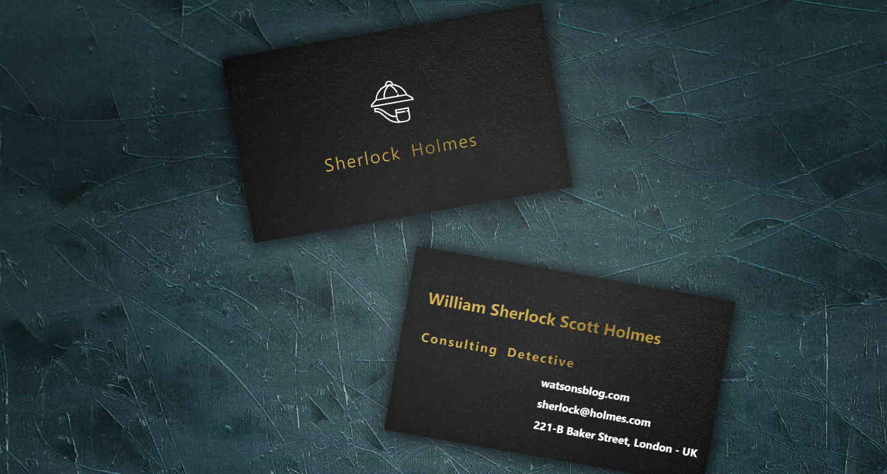

# Business Card
> React project where I tested how to work with animations based on mouse movement, and learned how to use masks in CSS. On the example I made a Sherlock Holmes style business card

## Features:
* Uses mouse movement to animate the screen
* It's responsive - doesn't move when running on mobile.



## Development setup

```sh
yarn
yarn start //start the development server
```


## Meta

Diego Lopes Ferreira - [LinkedIn](https://www.linkedin.com/in/diego-lopes-ferreira-a23a8919b/)

Distributed under the MIT license. See [license](LICENSE) for more information.
